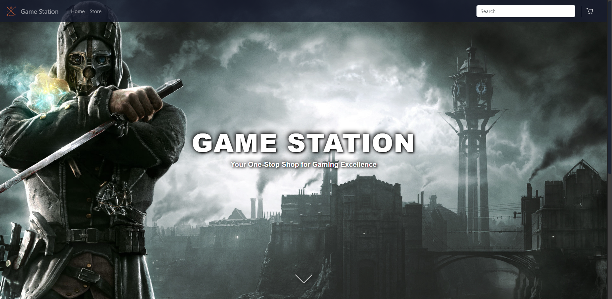
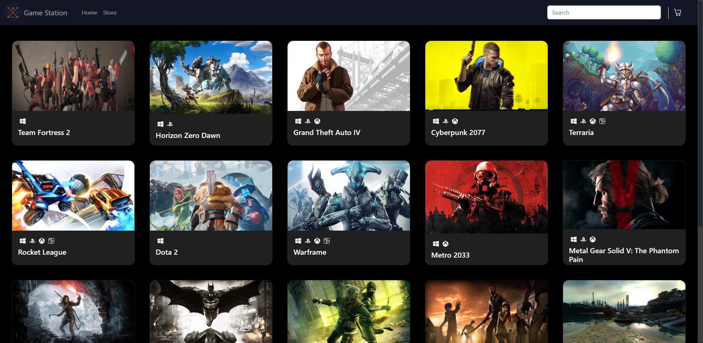
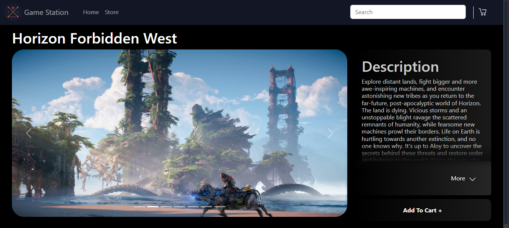
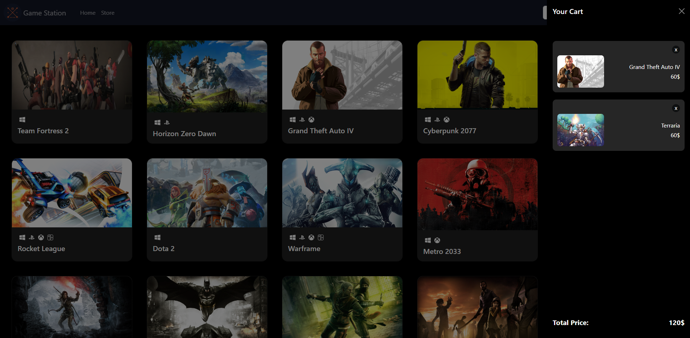

<h1 align ="center">Game Station</h1>


a front-end implementation of an E-commerce website leveraging the up-to-date database of [RAWG API](https://rawg.io/apidocs). done as a part of [The Odin Project](https://www.theodinproject.com/) curriculum.

## Live Preview

[Live Demo](https://khaled-game-station.netlify.app/)

## Built with

* [React](https://reactjs.org/) - JavaScript library for building user interfaces.
* [Bootstrap](https://getbootstrap.com/) - Front-end framework for responsive and visually appealing design.
* [CSS Modules](https://github.com/css-modules/css-modules) - For locally scoped CSS styling in React components.
* [npm](https://www.npmjs.com/) - Node Package Manager for managing project dependencies.
* [React Router](https://reactrouter.com/) - For client-side routing
* [RAWG API](https://rawg.io/apidocs) - Integration of the RAWG Video Games Database API for game data.
* [Framer Motion](https://www.framer.com/motion/) - Animation and motion library for creating interactive UI elements.

## Features

* Extensive regularely updated database of games provided by [RAWG API](https://rawg.io/apidocs)
* User-Friendly Navigation and smooth transitions
* Site search to find any required game
* Responsive design
* Detailed description of games and screenshots

## Screenshots






## Custom API Endpoints

#### Here are some examples of request and response payloads for the endpoints

1. **GET** ```/games```

* Request: nothing to provide

* Response:

```json
[
  {
    "id": 3498,
        "slug": "grand-theft-auto-v",
        "name": "Grand Theft Auto V",
        "released": "2013-09-17",
        "tba": false,
        "background_image": "https://media.rawg.io/media/games/20a/20aa03a10cda45239fe22d035c0ebe64.jpg",
        "rating": 4.47,
        "rating_top": 5,
        "ratings": [{
            "id": 5,
            "title": "exceptional",
            "count": 3934,
            "percent": 59.05
        }]
        ...
  }
  {
    "id": "cd196746-4bec-4199-8198-881efbe61233",
    ...
  }
  ...
]
```

2. **POST** ```/games```

* Request:

```json
{
    "name": "Aliens: Dark Descent",
    "background_image": "https://i.ytimg.com/vi/eWgYo55oOQk/maxresdefault.jpg",
    "description_raw": "In Aliens: Dark Descent, command a squad of hardened Colonial Marines to stop a terrifying Xenomorph outbreak on Moon Lethe. Lead your soldiers in real-time combat against iconic Xenomorphs, rogue operatives from the insatiable Weyland-Yutani Corporation, and a host of horrifying creatures new to the Alien franchise. You are the commander. They are your weapon. Infiltrate large open levels and annihilate enemies with your squad, dispatching orders strategically and intuitively at the touch of a button. Tread carefully, as your foes will adapt their tactics to your actions while hunting you down because death is permanent. Forge unique paths for survival, uncovering shortcuts, creating safe zones, and setting up motion trackers in a persistent world where your actions impact levels forever. Customize your squad with a selection of different classes. Level up and specialize your soldiers with unique abilities and an arsenal of weapons, armor, and perks, for high stakes missions in treacherous territory. Develop your base to research new tech and improve your squad even further. Manage your resources wisely and take calculated risks to outsmart the deadliest creature mankind has ever faced. Can you and your squad stop the outbreak before it’s too late? • Face off in a gripping original Alien story against iconic Xenomorph creatures ranging from Facehuggers to Praetorians, Alien Queens and many more, including rogue human commandos and a brand-new threat unique to this Alien storyline • Lead strategically and change squad tactics from mission to mission, carefully managing your soldiers’ health, resources, and sanity, to avoid permanent team losses and mental breakdowns • Forge unique paths for survival in a persistent world, uncovering shortcuts, creating safe zones and setting up motion trackers to stay one step ahead of these creatures • Assemble and level up squads composed of 5 starting Marines classes, with dozens of specializations, unique abilities and weapons.",
    "released": "2022-02-15",
    "platforms": ["PC", "PlayStation 5", "Xbox Series S/X", "PlayStation", 4, "Xbox", "One"],
    "genres": ["Action", "Strategy"],
    "publishers": ["Focus Entertainment"],
    "developers": ["Tindalos Interactive"],
    "website": "https://www.focus-entmt.com/games/aliens-dark-descent"
}
```

* Response:

```json
[{
    "name": "Aliens: Dark Descent",
    "background_image": "https://i.ytimg.com/vi/eWgYo55oOQk/maxresdefault.jpg",
    "description_raw": "In Aliens: Dark Descent, command a squad of hardened Colonial Marines to stop a terrifying Xenomorph outbreak on Moon Lethe. Lead your soldiers in real-time combat against iconic Xenomorphs, rogue operatives from the insatiable Weyland-Yutani Corporation, and a host of horrifying creatures new to the Alien franchise. You are the commander. They are your weapon. Infiltrate large open levels and annihilate enemies with your squad, dispatching orders strategically and intuitively at the touch of a button. Tread carefully, as your foes will adapt their tactics to your actions while hunting you down because death is permanent. Forge unique paths for survival, uncovering shortcuts, creating safe zones, and setting up motion trackers in a persistent world where your actions impact levels forever. Customize your squad with a selection of different classes. Level up and specialize your soldiers with unique abilities and an arsenal of weapons, armor, and perks, for high stakes missions in treacherous territory. Develop your base to research new tech and improve your squad even further. Manage your resources wisely and take calculated risks to outsmart the deadliest creature mankind has ever faced. Can you and your squad stop the outbreak before it’s too late? • Face off in a gripping original Alien story against iconic Xenomorph creatures ranging from Facehuggers to Praetorians, Alien Queens and many more, including rogue human commandos and a brand-new threat unique to this Alien storyline • Lead strategically and change squad tactics from mission to mission, carefully managing your soldiers’ health, resources, and sanity, to avoid permanent team losses and mental breakdowns • Forge unique paths for survival in a persistent world, uncovering shortcuts, creating safe zones and setting up motion trackers to stay one step ahead of these creatures • Assemble and level up squads composed of 5 starting Marines classes, with dozens of specializations, unique abilities and weapons.",
    "released": "2022-02-15",
    "platforms": ["PC", "PlayStation 5", "Xbox Series S/X", "PlayStation", 4, "Xbox", "One"],
    "genres": ["Action", "Strategy"],
    "publishers": ["Focus Entertainment"],
    "developers": ["Tindalos Interactive"],
    "website": "https://www.focus-entmt.com/games/aliens-dark-descent"
}]
```

3. **DELETE** ```/games/:id```

* Request:

```json
{
  "id": "cd196746-4bec-4199-8198-881eabe61233",
}
```

* Response: nothing to provide

## Installation

#### Here are the instructions if you want to work on the proejct locally

1. Clone the repository.

```sh
HTTPS - $ git clone https://github.com/Khaled0P/Game-Station.git
or
SSH - $ git@github.com:Khaled0P/Game-Station.git
```

2. Move to the cloned directory.

```sh
cd Game-Station
```

3. Install the dependencies.

```sh
$ npm i
or
$ yarn
```

4. [Create a RAWG account](https://rawg.io/apidocs) to get your API key.

5. Replace the current key with your own.

6. Start the project.

```sh
$ npm start
or
$ yarn start
```
